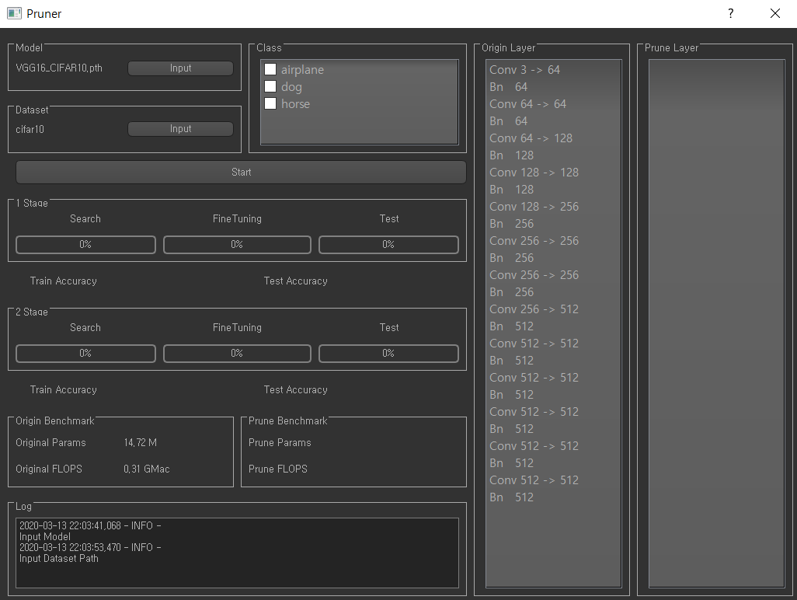

# Prune_QTorch
Deep Learning Pruning Tools Using PyTorch


## Dataset Structure

```
Prune_QTorch
  | datasets
     | cifar10 | train | airplane | .jpg ...
     |                 | dog      | .jpg ...
     |         | test  
     |
     | custom  | train | Class1   | .jpg ...
               |       | Class2   | .jpg ...
               | test
```

## Main


## Input Model & Dataset



## How to use??
```shell script
python main.py
```

- Model Input
- Dataset Input
- **Check Only One** Class
- Click Start

### 문제점
- 실행중 다른행동시 응답없음

TODO:
- [ ] QThread

