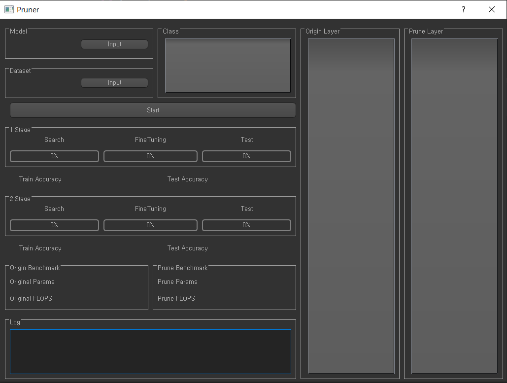

## Main



## Input Model & Dataset


## How to use??
```shell script
python view.py
```

- Model Input
- Dataset Input
- **Check Only One** Class
- Click Start

### 문제점
- 실행중 다른행동시 응답없음

TODO:
- [ ] QThread
